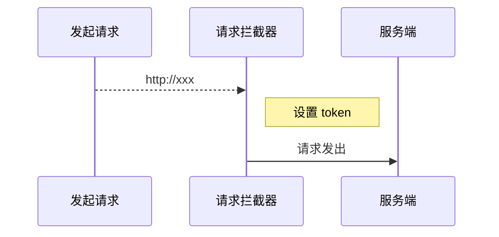

# toutiao-m

1、ssh与http是两种不同的协议 ssh更加安全 可以做到不用输入密码

2、动态路由传参数

```
{
  path: '/article/:articleId',
  name: 'article',
  component: () => import('@/views/article'),
  // 将路由动态参数映射到组件的 props 中，更推荐这种做法
  props: true
}
```

## 深度作用选择器

如果你希望 `scoped` 样式中的一个选择器能够作用得“更深”，例如影响子组件，你可以使用 `>>>` 操作符：

```html
<style scoped>
.a >>> .b { /* ... */ }
</style>
```

上述代码将会编译成：

```css
.a[data-v-f3f3eg9] .b { /* ... */ }
```

有些像 Sass 之类的预处理器无法正确解析 `>>>`。这种情况下你可以使用 `/deep/` 或 `::v-deep` 操作符取而代之——两者都是 `>>>` 的别名，同样可以正常工作。

## 动态生成的内容动态生成的内容

JavaScript 能够准确表示的整数范围在`-2^53`到`2^53`之间（不含两个端点），超过这个范围，无法精确表示这个值，这使得 JavaScript 不适合进行科学和金融方面的精确计算。

```javascript
Math.pow(2, 53) // 9007199254740992

9007199254740992  // 9007199254740992
9007199254740993  // 9007199254740992

Math.pow(2, 53) === Math.pow(2, 53) + 1
// true
```

上面代码中，超出 2 的 53 次方之后，一个数就不精确了。 ES6 引入了`Number.MAX_SAFE_INTEGER`和`Number.MIN_SAFE_INTEGER`这两个常量，用来表示这个范围的上下限。

```javascript
Number.MAX_SAFE_INTEGER === Math.pow(2, 53) - 1
// true
Number.MAX_SAFE_INTEGER === 9007199254740991
// true

Number.MIN_SAFE_INTEGER === -Number.MAX_SAFE_INTEGER
// true
Number.MIN_SAFE_INTEGER === -9007199254740991
// true
```

上面代码中，可以看到 JavaScript 能够精确表示的极限。

后端返回的数据一般都是 **JSON 格式的字符串**。

```json
'{ "id": 9007199254740995, "name": "Jack", "age": 18 }'
```

如果这个字符不做任何处理，你能方便的获取到字符串中的指定数据吗？非常麻烦。所以我们要把它转换为 JavaScript 对象来使用就很方便了。

幸运的是 axios 为了方便我们使用数据，它会在内部使用 `JSON.parse()` 把后端返回的数据转为 JavaScript 对象。

```javascript
// { id: 9007199254740996, name: 'Jack', age: 18 }
JSON.parse('{ "id": 9007199254740995, "name": "Jack", "age": 18 }')
```

可以看到，超出安全整数范围的 id 无法精确表示，这个问题并不是 axios 的错。

了解了什么是大整数的概念，接下来的问题是如何解决？

[json-bigint](https://github.com/sidorares/json-bigint) 是一个第三方包，它可以帮我们很好的处理这个问题。

使用它的第一步就是把它安装到你的项目中。

```shell
npm i json-bigint
```

下面是使用它的一个简单示例。

```javascript
const jsonStr = '{ "art_id": 1245953273786007552 }'

console.log(JSON.parse(jsonStr)) // 1245953273786007600
// JSON.stringify()

// JSONBig 可以处理数据中超出 JavaScript 安全整数范围的问题
console.log(JSONBig.parse(jsonStr)) // 把 JSON 格式的字符串转为 JavaScript 对象

// 使用的时候需要把 BigNumber 类型的数据转为字符串来使用
console.log(JSONBig.parse(jsonStr).art_id.toString()) // 1245953273786007552

console.log(JSON.stringify(JSONBig.parse(jsonStr)))

console.log(JSONBig.stringify(JSONBig.parse(jsonStr))) // 把 JavaScript 对象 转为 JSON 格式的字符串转
```


> json-bigint 会把超出 JS 安全整数范围的数字转为一个 BigNumber 类型的对象，对象数据是它内部的一个算法处理之后的，我们要做的就是在使用的时候转为字符串来使用。

通过 Axios 请求得到的数据都是 Axios 处理（JSON.parse）之后的，我们应该在 Axios 执行处理之前手动使用 json-bigint 来解析处理。Axios 提供了自定义处理原始后端返回数据的 API：`transformResponse` 。

```javascript
import axios from 'axios'

import jsonBig from 'json-bigint'

var json = '{ "value" : 9223372036854775807, "v2": 123 }'

console.log(jsonBig.parse(json))

const request = axios.create({
  baseURL: 'http://ttapi.research.itcast.cn/', // 接口基础路径

  // transformResponse 允许自定义原始的响应数据（字符串）
  transformResponse: [function (data) {
    try {
      // 如果转换成功则返回转换的数据结果
      return jsonBig.parse(data)
    } catch (err) {
      // 如果转换失败，则包装为统一数据格式并返回
      return {
        data
      }
    }
  }]
})

export default request
```

### [处理相对时间](https://www.lipengzhou.com/#/vuejs/toutiao-m/04-首页-文章列表?id=处理相对时间)

推荐两个第三方库：

- [Moment.js](https://momentjs.com/)
- [Day.js](https://day.js.org/)

两者都是专门用于处理时间的 JavaScript 库，功能差不多，因为 Day.js 的设计就是参考的 Moment.js。但是 Day.js 相比 Moment.js 的包体积要更小一些，因为它采用了插件化的处理方式。

[Day.js](https://day.js.org/zh-CN/) 是一个轻量的处理时间和日期的 JavaScript 库，和 [Moment.js](https://momentjs.com/) 的 API 设计保持完全一样，如果您曾经用过 Moment.js, 那么您已经知道如何使用 Day.js 。

- Day.js 可以运行在浏览器和 Node.js 中。
- 🕒 和 Moment.js 相同的 API 和用法
- 💪 不可变数据 (Immutable)
- 🔥 支持链式操作 (Chainable)
- 🌐 国际化 I18n
- 📦 仅 2kb 大小的微型库
- 👫 全浏览器兼容

下面是具体的操作流程。

安装 dayjs：

```sh
npm i dayjs
```

创建封装 `utils/dayjs.js`：

```js
import Vue from 'vue'
import dayjs from 'dayjs'

// 加载中文语言包
import 'dayjs/locale/zh-cn'

import relativeTime from 'dayjs/plugin/relativeTime'

// 配置使用处理相对时间的插件
dayjs.extend(relativeTime)

// 配置使用中文语言包
dayjs.locale('zh-cn')

// 全局过滤器：处理相对时间
Vue.filter('relativeTime', value => {
  return dayjs().from(dayjs(value))
})
```

在 `main.js` 中加载初始化：

```js
import './utils/dayjs'
```

使用过滤器：

```html
<span>{{ article.pubdate | relativeTime }}</span>
```

### [处理展示推荐频道](https://www.lipengzhou.com/#/vuejs/toutiao-m/05-首页-频道编辑?id=处理展示推荐频道)

思路：`所有频道 - 用户频道 = 推荐频道`

1、封装计算属性筛选数据


## [使用请求拦截器统一添加 Token](https://www.lipengzhou.com/#/vuejs/toutiao-m/03-我的?id=使用请求拦截器统一添加-token)

项目中的接口除了登录之外大多数都需要提供 token 才有访问权限。

通过接口文档可以看到，后端接口要求我们将 token 放到请求头 `Header` 中并以下面的格式发送。

> 字段名称：`Authorization`
>
> 字段值：`Bearer token`，注意 `Bearer` 和 `token` 之间有一个空格

方式一：在每次请求的时候手动添加（麻烦）。

```js
axios({
  method: "",
  url: "",
  headers: {
    Authorization: "Bearer token"
  }
})
```

方式二：使用请求拦截器统一添加（推荐，更方便）。



在 `src/utils/request.js` 中添加拦截器统一设置 token：

```js
/**
 * 请求模块
 */
import axios from 'axios'

// 在非组件模块中获取 store 必须通过这种方式
// 这里单独加载 store，和在组件中 this.$store 一个东西
import store from '@/store/'

const request = axios.create({
  baseURL: 'http://ttapi.research.itcast.cn/' // 基础路径
})

// 请求拦截器
// Add a request interceptor
request.interceptors.request.use(function (config) {
  // Do something before request is sent
  const { user } = store.state

  // 如果用户已登录，统一给接口设置 token 信息
  if (user) {
    config.headers.Authorization = `Bearer ${user.token}`
  }

  // 处理完之后一定要把 config 返回，否则请求就会停在这里
  return config
}, function (error) {
  // Do something with request error
  return Promise.reject(error)
})

// 响应拦截器

// 导出
export default request
```

### [防抖优化](https://www.lipengzhou.com/#/vuejs/toutiao-m/06-文章搜索?id=防抖优化)

1、安装 lodash

```sh
# yarn add lodash
npm i lodash
```

2、防抖处理

```js
// lodash 支持按需加载，有利于打包结果优化
import { debounce } from "lodash"
```

> 不建议下面这样使用，因为这样会加载整个模块。
>
> ```js
> import _ from 'lodash'
> _.debounce()
> ```

```js
// debounce 函数
// 参数1：函数
// 参数2：防抖时间
// 返回值：防抖之后的函数，和参数1功能是一样的
onSearchInput: debounce(async function () {
  const searchContent = this.searchContent
  if (!searchContent) {
    return
  }

  // 1. 请求获取数据
  const { data } = await getSuggestions(searchContent)

  // 2. 将数据添加到组件实例中
  this.suggestions = data.data.options

  // 3. 模板绑定
}, 200),
```

### [搜索关键字高亮](https://www.lipengzhou.com/#/vuejs/toutiao-m/06-文章搜索?id=搜索关键字高亮)

如何将字符串中的指定字符在**网页**中高亮展示？

```js
"Hello World";
```

将需要高亮的字符包裹 HTML 标签，为其单独设置颜色。

```js
"Hello <span style="color: red">World</span>"
```

在 Vue 中如何渲染带有 HTML 标签的字符串？

```js
data () {
  return {
    htmlStr: 'Hello <span style="color: red">World</span>'
  }
}
<div>{{ htmlStr }}</div>
<div v-html="htmlStr"></div>
```


如何把字符串中指定字符统一替换为高亮（包裹了 HTML）的字符？

```js
const str = "Hello World"

// 结果：<span style="color: red">Hello</span> World
"Hello World".replace('Hello', '<span style="color: red">Hello</span>')

// 需要注意的是，replace 方法的字符串匹配只能替换第1个满足的字符
// <span style="color: red">Hello</span> World Hello abc
"Hello World Hello abc".replace('Hello', '<span style="color: red">Hello</span>')

// 如果想要全文替换，使用正则表达式
// g 全局
// i 忽略大小写
// <span style="color: red">Hello</span> World <span style="color: red">Hello</span> abc
"Hello World Hello abc".replace(/Hello/gi, '<span style="color: red">Hello</span>')
```

> 一个小扩展：使用字符串的 split 结合数组的 join 方法实现高亮
>
> ```js
> var str = "hello world 你好 hello";
> 
> // ["", " world 你好 ", ""]
> const arr = str.split("hello");
> 
> // "<span>hello</span> world 你好 <span>hello</span>"
> arr.join("<span>hello</span>");
> ```

下面是具体的处理。

1、在 methods 中添加一个方法处理高亮

```js
// 参数 source: 原始字符串
// 参数 keyword: 需要高亮的关键词
// 返回值：替换之后的高亮字符串
highlight (source, keyword) {
  // /searchContent/ 正则表达式中的一切内容都会当做字符串使用
  // 这里可以 new RegExp 方式根据字符串创建一个正则表达式
  // RegExp 是原生 JavaScript 的内置构造函数
  // 参数1：字符串，注意，这里不要加 //
  // 参数2：匹配模式，g 全局，i 忽略大小写
  const reg = new RegExp(keyword, 'gi')
  return source.replace(reg, `<span style="color: #3296fa">${keyword}</span>`)
},
```

2、然后在联想建议列表项中绑定调用

```html
<!-- 联想建议 -->
<van-cell-group v-else-if="searchContent">
  <van-cell
    icon="search"
    v-for="(item, index) in suggestions"
    :key="index"
    @click="onSearch(item)"
  >
    <div slot="title" v-html="highlight(item, searchContent)"></div>
  </van-cell>
</van-cell-group>
<!-- /联想建议 -->
```

### [解决弹层中组件内容不更新问题](https://www.lipengzhou.com/#/vuejs/toutiao-m/08-文章评论?id=解决弹层中组件内容不更新问题)

弹层组件：

- 如果初始的条件是 false，则弹层的内容不会渲染
- 程序运行期间，当条件变为 true 的时候，弹层才渲染了内容
- 之后切换弹层的展示，弹层只是通过 CSS 控制隐藏和显示

弹层渲染出来以后就只是简单的切换显示和隐藏，里面的内容也不再重新渲染了，所以会导致我们的评论的回复列表不会动态更新了。解决办法就是在每次弹层显示的时候重新渲染组件。

```html
<!-- 评论回复 -->
<van-popup
  v-model="isReplyShow"
  get-container="body"
  round
  position="bottom"
  :style="{ height: '90%' }"
>
  <!-- 回复列表 -->
  <comment-reply :comment="currentComment" + v-if="isReplyShow" />
  <!-- /回复列表 -->
</van-popup>
<!-- 评论回复 -->
```

## 组件上使用V-model

当你传递给子组件的数据既要使用又要修改例如这里的name 这种情况使用V-model 默认传递的是名叫valued的数据 ：value="user.name"默认监听子组件传递的input事件@input="user.name=$event"

只能使用一次v-model

如果需要多个数据保存同步 使用.sync修饰符

：gender.sync="user.gender"

等同于

:gender=user.gender

@update:gender="user.gender=$evevt"

```
  <update-name @cancel="isEditNameShow=false" 
      :name="user.name" 
      @updateName="user.name=$event"/>
      等价于
        <update-name @cancel="isEditNameShow=false" 
      	v-model="user.name"/>
```


